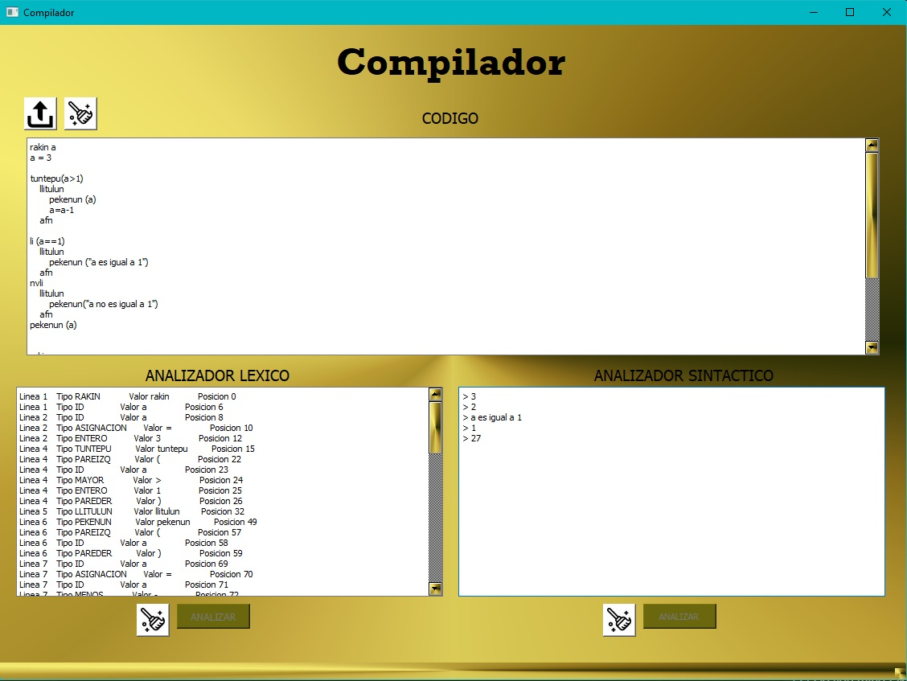
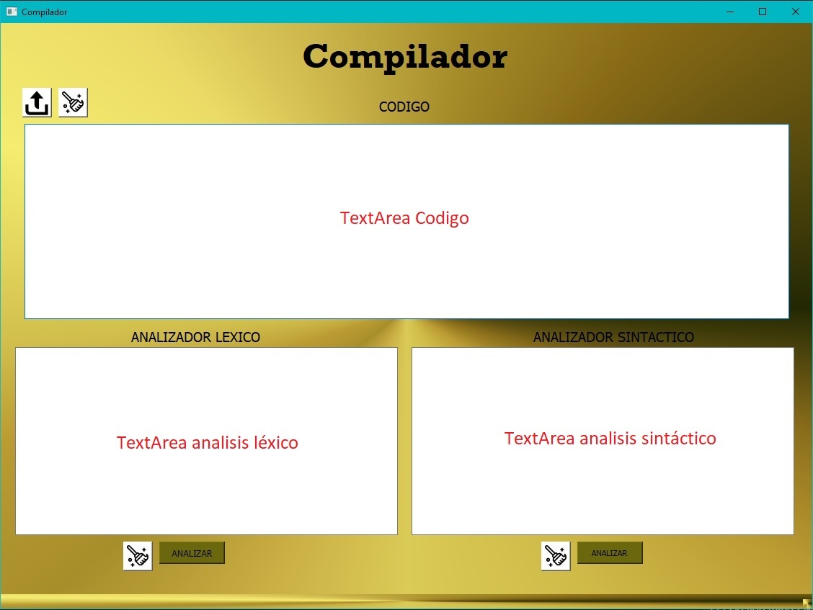

# Compilador

El siguiente compilador esta realizado con Python y este consiste en realizar un análisis lexico y sintactico en el contexto basado a lengua Mapuzugun.

## Manual de usuario ✒️

Para empezar necesitamos conocer la notacion de las palabras reservadas que usan y reconoce el interpretador:

* rakin = hace referencia a un tipo de dato entero o interger como se es conocido popularmente.
* chillka = hace referencia a un tipo de dato cadena o string como se es conocido popularmente.
* llitulun = se usa para indicar la apertura de una seccion de instrucciones en un ciclo o una sentencia condicional.
* afn = se usa para indicar el cierre de una seccion de instrucciones en un ciclo o una sentencia condicional.
* li = hace referencia a una sentencia condicional if, donde la condicion se escribe entre parentesis.
* nvli = hace referencia a una sentencia condicional else.
* nv = hace referencia a un operador de negacion (not).
* tuntepu = hace referencia a un ciclo o bucle while para ejecutar instrucciones periodicamente, la condicion se escribe entre parentesis.
* pekenun = hace referencia a la funcion print, para mostrar por consola la variable o cadena que este dentro de los parentesis que deben acompañarla.
* @ = indica el inicio de un comentario en una sola linea en el codigo.

El codigo o instrucciones que analizara el interpretador reconocera las palabras reservadas explicadas anteriormente segun la funcion descrita. La interfaz del compilador contiene una seccion exclusiva para escribir el codigo a analizar. En esta seccion puedes escribir un texto manualmente, o utilizar el primer boton de la parte superior que sirve para importar un archivo de texto, Se incluye en el repositorio un archivo de texto en la carpeta /test con codigo de ejemplo para realizar una interpretacion. 
En la seccion inferior de la interfaz se incluyen 2 secciones de texto para recibiri y mostrar el analisis correspondiente, ya sea lexico o sintactico. En esta seccion se ubican 2 botones correspondientes para realizar el analisis o borrar/limpiar el cuadro. En la seccion superior tambien se incluye un boton para limpiar, pero este realiza una limpieza en las 3 secciones de texto.

## Ejecutando las pruebas ⚙️

Se debe ingresar manualmente o cargando un archivo de texto el codigo a utilizar, y posteriormente ser analizado. Posee una interfaz simple de usar y entender.
Posee un archivo de prueba en la carpeta /test

## Construido con 🛠️

* [Python 3.8](https://www.python.org)
* [PLY](https://www.dabeaz.com/ply/)
* [PyQt5](https://pypi.org/project/PyQt5/)

## Captura de la interfaz gráfica

## Autores ✒️

* **Nicolás Rivas** [nrivas2017](https://github.com/nrivas2017)
* **Juan Pérez** [juandpez](https://github.com/juandpez)
* **Marco Pedemonte** [mpedemonte](https://github.com/mpedemonte)
* **Rodrigo Becerra** [RodrigoBecerra](https://github.com/RodrigoBecerra)

También puedes mirar la lista de todos los [contribuyentes](https://github.com/nrivas2017/compilador/graphs/contributors) quíenes han participado en este proyecto. 
